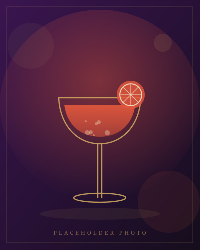

# Shake&Steer — cocktail catering website

A complete, static marketing website for a mobile cocktail bar. Plain HTML, CSS
and JavaScript — no build step, no frameworks, no npm. Open `index.html` in a
browser and it works; push it to GitHub and it is live.

**Six pages** (Home, About, Menu, Gallery, Services, Contact) · **five languages**
(English, Serbian, Russian, German, Chinese) · **dark and light mode** ·
**two downloadable PDF menus** with the full ~70-cocktail list.

---

## 1. Look at it on your computer

**The quick way:** double-click `index.html`. Everything works — except the
language switcher, because browsers block local file access for security.

**The proper way** (needed to test the other four languages). Open a terminal in
this folder and run:

```bash
python -m http.server 8000
```

Then open <http://localhost:8000>. Any tiny web server will do; this one comes
with Python.

---

## 2. Put it online with GitHub Pages

The site is designed to sit at the **root of the repository** — no `/docs`
folder, no configuration, no build. Just push and switch it on.

1. **Create the repository.** On [github.com](https://github.com) click
   **New repository**, give it a name (for example `shake-and-steer`), leave it
   **Public**, and click **Create repository**.

2. **Push these files.** In a terminal, in this folder:

   ```bash
   git init
   git add .
   git commit -m "Shake&Steer website"
   git branch -M main
   git remote add origin https://github.com/YOUR-USERNAME/YOUR-REPO.git
   git push -u origin main
   ```

   (Or use GitHub Desktop, or drag the files into the browser with
   **Add file → Upload files**.)

3. **Turn Pages on.** In the repository go to **Settings → Pages**. Under
   *Build and deployment* set:
   - **Source:** `Deploy from a branch`
   - **Branch:** `main` and folder `/ (root)`

   Click **Save**.

4. **Wait about a minute**, then reload the Settings → Pages screen. Your site
   is at:

   ```
   https://YOUR-USERNAME.github.io/YOUR-REPO/
   ```

To publish changes later, edit the files and push again — Pages redeploys
automatically within a minute or two.

### Using your own domain

1. Buy the domain, then at your registrar add DNS records pointing at GitHub:
   - Four **A** records for the bare domain (`example.com`) →
     `185.199.108.153`, `185.199.109.153`, `185.199.110.153`, `185.199.111.153`
   - One **CNAME** record for `www` → `YOUR-USERNAME.github.io`
2. In **Settings → Pages → Custom domain**, type your domain and click **Save**.
   GitHub writes a `CNAME` file into the repository for you.
3. Once DNS has propagated (minutes to a day), tick **Enforce HTTPS**.

---

## 3. What to change — the short list

Everything you are likely to edit is in one of five places:

| You want to change… | Go to |
| --- | --- |
| E-mail, phone, address, social links | `contact.html`, plus the footer of all six `.html` files |
| Wording on a page (English) | that page's `.html` file |
| Wording in the other four languages | `i18n/sr.json`, `ru.json`, `de.json`, `zh.json` |
| Photographs | `assets/img/` |
| The 10 cocktails shown on the site | `menu.html` |
| The ~70 cocktails in the PDFs | `tools/menu_data.py`, then re-run the PDF script |
| Colours, fonts, spacing | the top of `assets/css/base.css` |

### 3.1 Contact details

Every placeholder is written as **`[REPLACE: something]`** and is highlighted on
the page with a dashed gold box, so you cannot miss them. They are all on
`contact.html`.

The **e-mail and phone also appear in the footer of all six pages**. The fastest
way to catch every one: search the whole folder for these three strings and
replace them.

```
hello@example.com      →  your real e-mail
+000000000000          →  your real phone, digits only (used in tel: and wa.me links)
+00 000 000 000        →  your real phone, as you want it displayed
```

Also replace the social links — search for `instagram.com/`, `tiktok.com/`,
`facebook.com/`, `wa.me/` and `youtube.com/` and put your real profile URLs in.

Once you have filled everything in, you can delete the `.placeholder` style rule
in `assets/css/components.css` (search for "placeholder") so no dashed boxes are
left behind.

### 3.2 Other placeholders on the site

Search the `.html` files for the word `PLACEHOLDER` in the comments. You will
find:

- **Statistics** on the home page (480+ events, 12k guests, 9 years…) — in
  `index.html`, in the block marked `PLACEHOLDER NUMBERS`.
- **Testimonials** on the home and about pages — real quotes go in
  `i18n/*.json` under `home.quote.text` and `about.quote.text`, and the client
  name is in the `.html` file.

### 3.3 Photographs

All images are placeholder SVG drawings in `assets/img/`:

| File | Used for |
| --- | --- |
| `cocktail-01.svg` … `cocktail-10.svg` | the ten cocktails on the Menu page |
| `gallery-01.svg` … `gallery-12.svg` | the Gallery page |
| `scene-bar.svg`, `scene-story.svg`, `scene-craft.svg`, `scene-team.svg` | Home and About pages |
| `logo.svg` | the logo in the header, footer and browser tab |

**The easy way to replace them:** save your photo with the same name but a real
image extension (`cocktail-01.jpg`), put it in `assets/img/`, then change the
`src="…"` in the HTML from `.svg` to `.jpg`. Suggested sizes: cocktails
**800 × 1000 px** (portrait), gallery **1600 × 1200 px**, page scenes
**1200 × 1400 px**. Save them as JPG at around 80% quality to keep the site fast.

Remember to update the `alt="…"` text too — it is what screen readers announce
and what search engines read. The translated alt texts live in `i18n/*.json`
under `gallery.i1.alt`, `menu.c1.alt` and so on.

### 3.4 The 10 cocktails on the Menu page

In `menu.html`, each one is a block like this:

```html
<article class="cocktail reveal">
  <div class="cocktail__media">
    <span class="cocktail__tag" data-i18n="menu.tags.whisky">Whisky</span>
    
  </div>
  <div class="cocktail__body">
    <h3 class="cocktail__name">Velvet Sovereign</h3>
    <p data-i18n="menu.c1.desc">Aged whisky softened with fig and vanilla…</p>
  </div>
</article>
```

- The **name** is plain text in the HTML — drink names normally stay the same in
  every language, so it is not translated.
- The **description** is translated: change the English here *and* the matching
  `menu.c1.desc` key in all five `i18n/*.json` files.
- The **tag** (Whisky, Gin, …) picks one of the ready-made labels under
  `menu.tags` in the JSON files.

Four of these same cocktails are also teased on the home page (`index.html`) —
they reuse the same translation keys, so a description only has to be edited
once in the JSON.

---

## 4. Translations

One set of HTML pages serves all five languages.

- The **English text is written directly in the HTML**. That is the fallback: if
  JavaScript is off, or the page is opened straight from disk, the site still
  reads correctly in English.
- Every translatable element carries `data-i18n="some.key"`.
- `assets/js/i18n.js` loads `i18n/<language>.json` and swaps the text in.
- The choice is remembered in the browser (`localStorage`).

### Editing an existing translation

Open `i18n/sr.json` (or `ru`, `de`, `zh`), find the key and change the text.
Keep the quotes and commas exactly as they are — it is a JSON file and one
missing comma breaks the whole language.

### Adding new text to a page

1. In the HTML: `<p data-i18n="home.newThing">English text here</p>`
2. Add `"newThing": "…"` under `home` in **all five** JSON files.
3. Check nothing is missing:

   ```bash
   python tools/check-i18n.py
   ```

   It reports any key used in the HTML but missing from a language file, and any
   key in a language file that nothing uses.

### Adding a sixth language

1. Copy `i18n/en.json` to `i18n/xx.json` and translate it.
2. In `assets/js/i18n.js`, add one line to the `LANGUAGES` list near the top:

   ```js
   { code: "xx", label: "XX", name: "Language name" }
   ```

That is all — the switcher builds itself from that list.

### Special variants

| Attribute | What it does |
| --- | --- |
| `data-i18n="key"` | replaces the element's text |
| `data-i18n-html="key"` | replaces its HTML (use when the text contains `<em>`, `<br>`) |
| `data-i18n-attr="alt:key, title:key"` | replaces attributes |

---

## 5. The PDF menus

Two print-ready A4 PDFs live in `downloads/`:

- `shake-and-steer-menu-en.pdf` — English
- `shake-and-steer-menu-sr.pdf` — Serbian

Each is 10 pages: a cover, an introduction with a table of contents, all **70
cocktails** in seven chapters with a description and full ingredients for every
drink, and a back page with your contact details.

On the Menu page the big **Download full menu (PDF)** button follows the
language chosen in the header — Serbian visitors get the Serbian file, everyone
else gets English — and both files are always reachable through the two smaller
buttons next to it.

### Editing the cocktail list

1. Open `tools/menu_data.py`. Each drink is five lines:

   ```python
   ("Cocktail name",
    "English description",  "English ingredients",
    "Serbian description",  "Serbian ingredients"),
   ```

   The contact details printed on the PDF's back page are in the `CONTACT`
   block at the top of the same file — replace those too.

2. Rebuild both PDFs:

   ```bash
   python tools/make-pdf.py
   ```

That is the only step. The generator needs nothing but Python 3 — the PDF writer
(`tools/pdfkit.py`) is included and embeds subsetted system fonts, which is what
makes Serbian characters like č, ć, š, ž and đ come out correctly.

### Replacing the PDFs with your own

If you would rather make the PDFs in Word or InDesign, just drop your files into
`downloads/` using the same two file names and nothing else needs to change.

---

## 6. Colours, fonts and other styling

Almost every visual decision is a CSS variable at the top of
`assets/css/base.css`:

```css
:root {
  --plum-900: #150d1c;   /* page background        */
  --bordo-600: #6b1430;  /* burgundy accent        */
  --gold-500: #c9a35e;   /* gold / champagne       */
  --font-display: "Cormorant Garamond", …;  /* headings */
  --font-body: "Jost", …;                   /* body text */
}
```

Change a value there and the whole site follows. The light theme is the
`[data-theme="light"]` block just underneath.

- **Dark mode is the default.** To flip that, change `DEFAULT_THEME` at the top
  of `assets/js/theme.js` to `"light"`.
- **Fonts** come from Google Fonts, loaded by a `<link>` in each page's `<head>`.
  To change them, swap that link and the two `--font-*` variables.

### The CSS files

| File | Contains |
| --- | --- |
| `base.css` | colours, fonts, spacing, reset, scroll animations |
| `layout.css` | header, navigation, hero banners, footer |
| `components.css` | buttons, cards, cocktail grid, lightbox, packages, contact blocks |

### The JavaScript files

| File | Contains |
| --- | --- |
| `theme.js` | dark/light toggle, remembered between visits |
| `i18n.js` | the five-language switcher |
| `main.js` | sticky header, mobile menu, scroll animations, PDF language link |
| `gallery.js` | the gallery lightbox |

---

## 7. Project structure

```
.
├── index.html            Home
├── about.html            About
├── menu.html             Menu (10 signatures + PDF download)
├── gallery.html          Gallery with lightbox
├── services.html         Services + packages (no prices)
├── contact.html          Contact details (no form)
├── 404.html              Shown for unknown URLs on GitHub Pages
├── .nojekyll             Tells GitHub Pages to publish the files as-is
├── README.md             This file
│
├── assets/
│   ├── css/   base.css · layout.css · components.css
│   ├── js/    theme.js · i18n.js · main.js · gallery.js
│   └── img/   logo + 26 placeholder SVG images
│
├── i18n/      en.json · sr.json · ru.json · de.json · zh.json
├── downloads/ shake-and-steer-menu-en.pdf · shake-and-steer-menu-sr.pdf
│
└── tools/     Not part of the website — helper scripts only
    ├── menu_data.py      the 70 cocktails used in the PDFs
    ├── make-pdf.py       rebuilds both PDFs
    ├── pdfkit.py         the small PDF writer they use
    ├── make-images.py    regenerates the placeholder SVG artwork
    └── check-i18n.py     checks the five translation files
```

The `tools/` folder is safe to delete if you never want to regenerate the PDFs
or images — the website itself does not use it.

---

## 8. Notes

- The header and footer are **repeated in each HTML file**. There is no build
  step to share them, so if you change the navigation, copy the change into all
  six pages.
- No cookies, no tracking, no forms, no server. Nothing to maintain and nothing
  to leak.
- Tested to work without JavaScript (English only), on phones, and with a
  keyboard: the gallery lightbox responds to arrow keys and `Esc`, and there is
  a "skip to content" link for screen readers.
